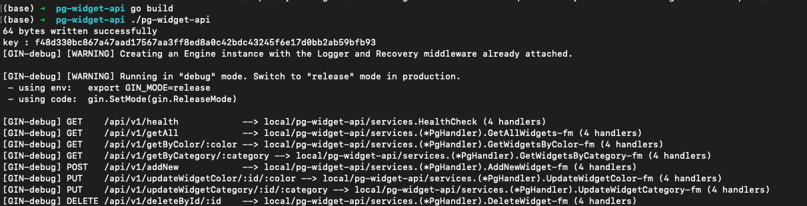
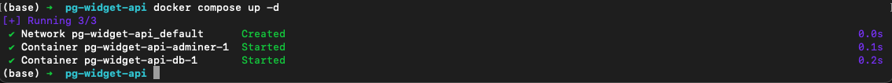

# PG-Widget-API

## Purpose

To provide a simple api / http microservice that supports a few common postgres data handling functions.
This api is written in GO for its simplicity and speed of use. It leverages a single database handler to support reciever functions.

### Files & Libs

#### libs

- <https://github.com/gin-gonic/gin>   -- http api framework for GO
- <https://github.com/jackc/pgx>  -- postgres library written in GO

#### files

- **services** folder contains receiver and utility functions to support endpoint functions
- **structs** contains structs for the widget model
- **images** supports this README
- *.env* - local environment file for testing
- *compose.yml* - a simple docker-compose file to spin up postgres database container and creates the widgetDB and table
- *init.sql* - file that creates the widgetdb/widget table structure used by compose
- *Dockerfile* - docker file for building the pg-api container
- *key.txt* - key file created on every start up. this file is stored in the container should be used if you want to secure an endpoint accessabilty
- *sample-data.sh* - a set of curl statements to load up some sample data

```bash
sh sample-data.sh
```

### Building and Deploying

#### Api



#### Postgres

(old docker-compsoe v1)

```docker
docker-compose up -d  
```

(new docker compose v2)



#### Testing the api

#### add new

```console
curl --location 'localhost:4000/api/v1/addNew' \
--header 'Content-Type: application/json' \
--data '{
    "name": "wid005",
    "category": "square",
    "color" : "purple"
}'
```

#### list widgets

```console
curl --location 'localhost:4000/api/v1/getAll'
```

enjoy!
